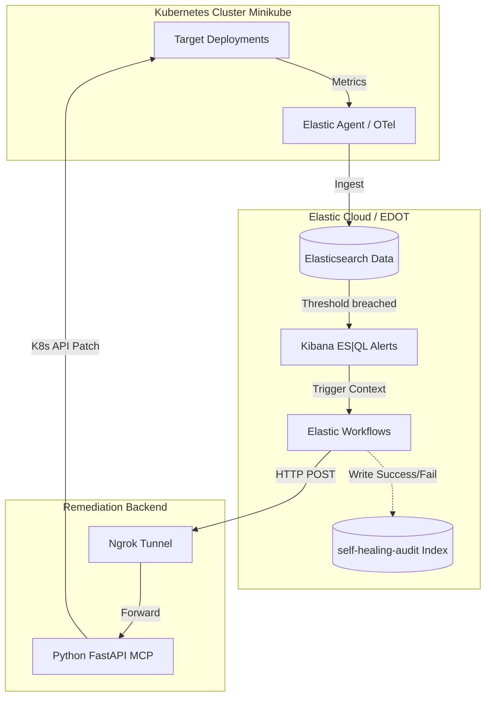

# 🛡️ Elastic-K8s Unified Self-Healing Architecture

An automated, closed-loop Site Reliability Engineering (SRE) project that detects Kubernetes anomalies using Elastic Observability (ES|QL) and automatically applies remediations via a custom Model Context Protocol (MCP) Python backend.

## 🏗️ Architecture

The system follows a strict separation of concerns:
1. **Detection (Elastic Rules):** Monitors K8s metrics and triggers ES|QL-based alerts.
2. **Orchestration (Elastic Workflows):** Acts as the message bus, calling the webhook and saving audit logs.
3. **Execution (Python MCP):** The "Brain". Validates the payload and securely patches the Kubernetes API.



## 📋 Prerequisites

Before starting, ensure you have the following installed:

* **Minikube** (or any compatible Kubernetes cluster).
* **Python 3.9+** (with `fastapi`, `uvicorn`, and `kubernetes` packages).
* **Ngrok** (to expose the local MCP to Elastic Cloud securely).
* **Elastic Stack**: Either via Elastic Cloud (EDOT) or vanilla ECK (Elastic Cloud on Kubernetes) Operator. The Elastic Agent must be deployed in your cluster to collect metrics.

## 🚀 Installation & Setup

### 1. Start the Remediation Bridge (MCP)

The Python MCP must be running and authenticated with your local K8s cluster.

```bash
# Install dependencies
pip install fastapi uvicorn kubernetes pydantic

# Run the server
python mcp-k8s-selfhealing.py

# In a new terminal, expose the port using ngrok
ngrok http 8000

```

*Note: Update the `mcp_bridge_url` inside your Elastic Workflows with the newly generated Ngrok URL.*

### 2. Create the Audit Index

To ensure ES|QL and Kibana Dashboards can correctly parse the timestamps, you must explicitly create the mapping for the audit index. Run this in **Kibana > Dev Tools**:

```json
PUT self-healing-audit
{
  "mappings": {
    "properties": {
      "@timestamp": { "type": "date" },
      "target_deployment": { "type": "keyword" },
      "action_type": { "type": "keyword" },
      "mcp_status": { "type": "keyword" }
    }
  }
}

```

### 3.  Alerting & Observability Logic

The observability system leverages Elastic's **ES|QL** engine to generate dynamic alerts. These rules are integrated with automated workflows to maintain cluster stability.

#### 3.1. Memory Monitoring (OOM Prevention) Alarm Rule

This alert tracks memory consumption relative to defined limits to preemptively address **Out of Memory** (OOM) events.

* **Objective:** Identify pods exceeding **70%** of their memory limit.
* **Logic:** It aggregates `working_set` and `memory_limit` metrics per pod within the `test-sre` namespace.
* **Linked Remediation:** `K8s Self-Healing - OOM (25% Increasement)` workflow.

**Query:**

```esql
FROM metrics-*
| WHERE kubernetes.namespace == "test-sre"
| STATS 
    usage_bytes = MAX(metrics.container.memory.working_set), 
    limit_bytes = MAX(k8s.container.memory_limit) 
  BY kubernetes.pod.name
| WHERE limit_bytes > 0
| EVAL 
    current_usage_mib = usage_bytes / 1024 / 1024,
    pressure_percentage = (usage_bytes * 100.0) / limit_bytes
| WHERE pressure_percentage > 70
| KEEP kubernetes.pod.name, current_usage_mib, pressure_percentage
| SORT pressure_percentage DESC

```

#### 3.2. Replica Compliance (Production State) Alarm Rule

Ensures that critical services prefixed with `prod-*` maintain high availability standards.

* **Objective:** Trigger an alert when a production deployment runs with **only 1 replica**.
* **Logic:** Filters cluster state metrics for deployments in the `test-sre` namespace that match the production naming convention.
* **Linked Remediation:** `k8s Self-Healing - Scale Replicas` workflow.

**Query:**

```esql
FROM metrics-*
| WHERE kubernetes.namespace == "test-sre"
| WHERE kubernetes.deployment.name LIKE "prod-*"
| STATS current_replicas = MAX(metrics.k8s.deployment.desired) 
  BY kubernetes.deployment.name
| WHERE current_replicas == 1
| KEEP kubernetes.deployment.name, current_replicas

```

---


### 4. Workflows

These workflows provide a closed-loop automation system. When an **ES|QL** rule triggers an alert, the workflow captures the context, sends a remediation request to the MCP bridge, and logs the result back into Elasticsearch for auditing.

#### Workflow A: Automatic Scale-Out (High Availability)

This workflow is triggered by replica count violations in production. It automates the scaling process without requiring manual intervention for instance calculation.

```yaml
# ==========================================
# k8s Self-Healing - Scale Replicas
# ==========================================
version: "1"
name: k8s Self-Healing - Scale Replicas
description: Automatic HA scaling remediation. Scaling logic delegated to MCP backend.

consts:
  mcp_bridge_url: "MCP URL"
  mcp_token: "MCP Token"
  audit_index: "self-healing-audit"

triggers:
  - type: alert

steps:
  # STEP 1: Call Remediation Bridge (MCP)
  - name: scale_horizontal
    type: http
    with:
      url: "{{ consts.mcp_bridge_url }}"
      method: POST
      headers:
        Content-Type: application/json
        Authorization: "Bearer {{ consts.mcp_token }}"
      body:
        action: "scale"
        target: "{{ event.alerts[0].kibana.alert.grouping.kubernetes.deployment.name }}" 
        namespace: "test-sre"
    timeout: 300s

  # STEP 2: Audit Trail
  - name: audit_remediation
    type: elasticsearch.index
    with:
      index: "{{ consts.audit_index }}"
      document:
        "@timestamp": "{{ event.alerts[0]['@timestamp'] }}"
        rule_name: "{{ event.alerts[0].kibana.alert.rule.name }}"
        target_deployment: "{{ event.alerts[0].kibana.alert.grouping.kubernetes.deployment.name }}"
        action_type: "scale_horizontal"
        mcp_status: "{{ steps.scale_horizontal.output.data.status }}"
        workflow_id: "{{ execution.workflowId }}"

```

#### Workflow B: Memory Increment (OOM Prevention)

This workflow resolves memory pressure by dynamically increasing limits. It has been unified with the audit schema to ensure dashboard compatibility.

```yaml
# ==========================================
# K8s Self-Healing - OOM (25% Increasement)
# ==========================================
version: '1'
name: K8s Self-Healing - OOM (25% Increasement)
description: Automatic memory limit adjustment based on real-time usage.

consts:
  mcp_bridge_url: "MCP URL"
  mcp_token: "MCP Token"
  audit_index: "self-healing-audit"

triggers:
  - type: alert

steps:
  # STEP 1: Call Remediation Bridge (MCP)
  - name: call_mcp_remediation
    type: http
    with:
      url: "{{ consts.mcp_bridge_url }}"
      method: POST
      headers:
        Content-Type: application/json
        Authorization: "Bearer {{ consts.mcp_token }}"
      body:
        action: "increment_memory"
        target: "{{ event.alerts[0].kibana.alert.grouping.kubernetes.pod.name }}"
        namespace: "test-sre"
    timeout: 300s

  # STEP 2: Audit Trail (Unified Schema)
  - name: audit_remediation
    type: elasticsearch.index
    with:
      index: "{{ consts.audit_index }}"
      document:
        "@timestamp": "{{ event.alerts[0]['@timestamp'] }}"
        rule_name: "{{ event.alerts[0].kibana.alert.rule.name }}"
        target_deployment: "{{ event.alerts[0].kibana.alert.grouping.kubernetes.pod.name }}"
        namespace: "test-sre"
        action_type: "increment_memory"
        mcp_status: "{{ steps.call_mcp_remediation.output.data.status }}"
        workflow_id: "{{ execution.workflowId }}"

```
---

## 🧪 Testing the Scenarios

### Scenario A: Vertical Scaling (OOM Prevention)

We simulate a memory leak where a pod exceeds its allocated limits.

1. **Deploy the stresser:**
```bash
kubectl apply -f k8s/deployment-oom-alarm.yaml

```


2. **Verification:**
* Watch the pod metrics in Elastic. Once it hits the 70%+ threshold, the alert fires.
* Run `kubectl describe deployment memory-stresser -n test-sre`.
* You will see the memory limits automatically patched and increased by 25%.


### Scenario B: Horizontal Scaling (High Availability)

We simulate a critical production app losing redundancy.

1. **Deploy the app with a single replica:**
```bash
kubectl apply -f k8s/deployment-ha-prod-alarm.yaml

```


2. **Verification:**
* The ES|QL alert detects the replica count is `< 2`.
* The workflow triggers the MCP.
* Run `kubectl get pods -n test-sre`. You will automatically see a second pod spinning up to ensure High Availability.


---

## 📊 Observability & Auditing

All actions are tracked in the **SRE Auto-Healing Operations Dashboard**.
To query the raw audit logs directly, use ES|QL in Kibana Discover:

```esql
FROM self-healing-audit
| KEEP @timestamp, action_type, target_deployment, mcp_status, mcp_message
| SORT @timestamp DESC


